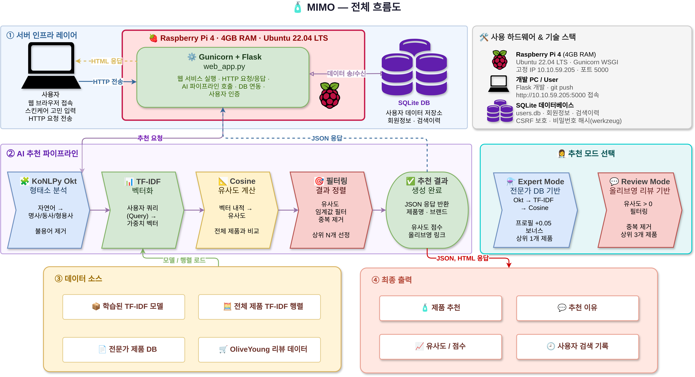
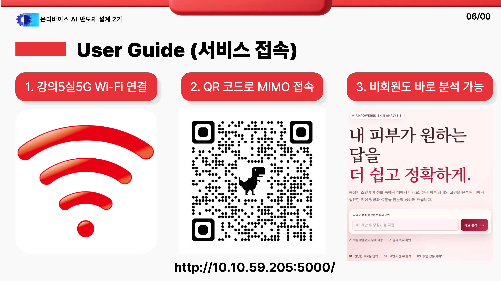
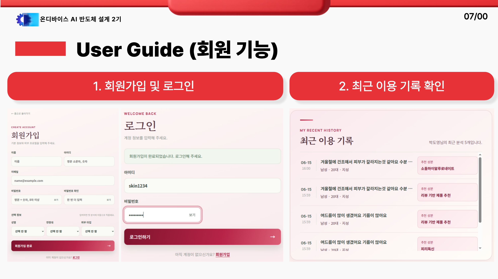
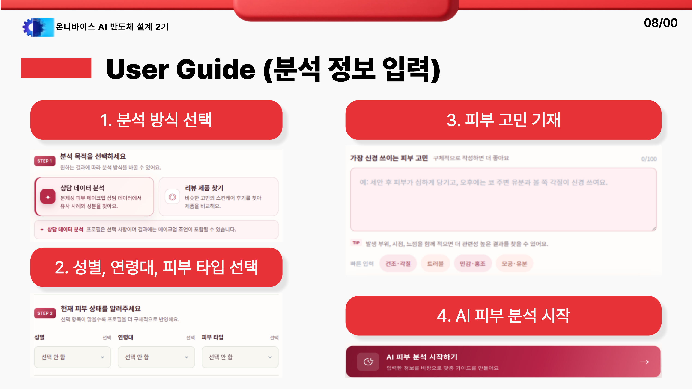
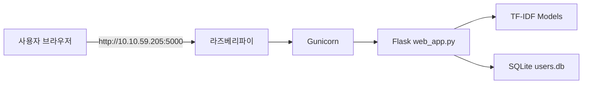
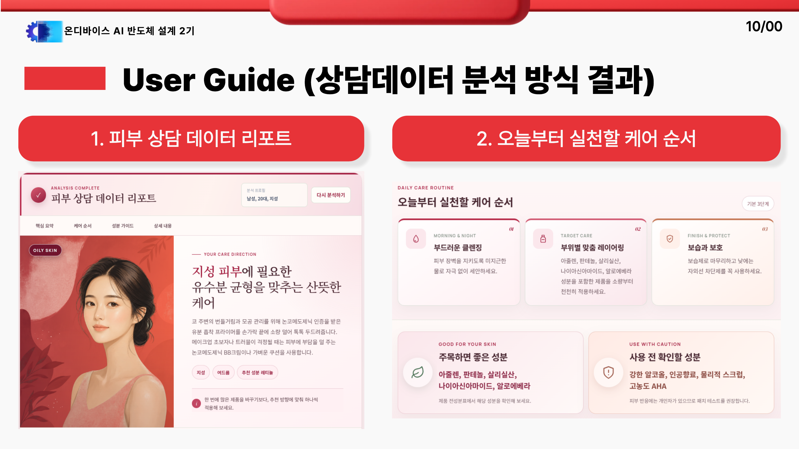
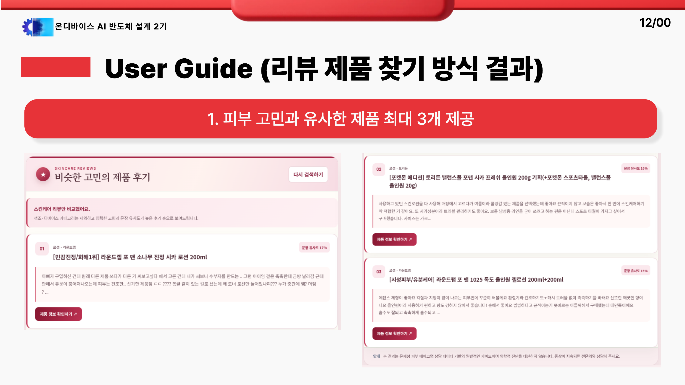

# 🧴 MIMO Skincare Recommendation

## 1. Project Summary (프로젝트 요약)

**MIMO(Me In, Match Out)** 는 사용자의 피부 고민과 프로필을 바탕으로 전문가 상담 데이터와 실제 올리브영 리뷰 데이터를 매칭해 맞춤 스킨케어 가이드를 제공하는 Flask 웹 애플리케이션입니다.

KoNLPy Okt 형태소 분석, TF-IDF 벡터화, 코사인 유사도를 활용해 피부 상담 리포트, 케어 순서, 추천/주의 성분, 관련 제품, 리뷰 기반 제품 추천을 제공합니다.

라즈베리파이에 Gunicorn 서버를 올려 같은 네트워크의 브라우저에서 바로 접속할 수 있도록 구성했습니다.

| 구분 | 내용 |
| :---: | :--- |
| 서비스명 | **MIMO** |
| 슬로건 | **Me In, Match Out** |
| 실행 앱 | `web_app.py` |
| 로컬 주소 | `http://127.0.0.1:5006` |
| 라즈베리파이 주소 | `http://10.10.59.205:5000` |
| 주요 데이터 | AI-Hub 전문가 상담 데이터, OliveYoung 제품/리뷰 데이터 |
| 추천 방식 | Expert Match / Review Match |

---

## 2. Key Features (주요 기능)

### 🔤 Korean NLP Preprocessing (한국어 전처리)

- 피부 고민 문장에서 한글만 추출
- KoNLPy Okt로 명사·동사·형용사 추출
- 2글자 이상 단어와 불용어 필터링 적용

### 📊 TF-IDF Vectorization (문장 벡터화)

- 상담 질문과 리뷰 텍스트를 TF-IDF 벡터로 변환
- 흔한 단어보다 고민을 구분하는 핵심 단어에 높은 가중치 부여
- 현재 사용자 쿼리와 기존 데이터의 의미적 근접도를 수치화

### 📐 Cosine Similarity Recommendation (유사도 기반 추천)

- 사용자 쿼리와 상담/리뷰 데이터를 코사인 유사도로 비교
- 전문가 상담 답변, 추천 성분, 피해야 할 성분 제공
- 리뷰 기반 제품 추천에서는 유사한 제품을 최대 3개 반환

### 🌐 Raspberry Pi Web Server (라즈베리파이 웹서버)

- Flask 앱을 Gunicorn으로 실행
- `0.0.0.0:5000` 바인딩으로 같은 네트워크에서 접속 가능
- systemd 서비스 등록 시 부팅 후 자동 실행 가능

---

## 🛠 3. Tech Stack (기술 스택)

### 3.1 Language & Framework


### 3.2 AI / Data Processing


| 기술 | 역할 |
| :---: | :--- |
| KoNLPy Okt | 한국어 형태소 분석 |
| TF-IDF | 상담/리뷰 텍스트 벡터화 |
| Cosine Similarity | 사용자 쿼리와 데이터 간 유사도 계산 |
| Flask | 웹 페이지와 추천 API 제공 |
| Gunicorn | 라즈베리파이 운영용 WSGI 서버 |
| SQLite | 회원 정보와 검색 이력 저장 |

---

## 📂 4. Project Structure (프로젝트 구조)

```text
Project_Skincare_Recommendation/
├── web_app.py                              # Flask 최종 실행 앱
├── rebuild_skin_tfidf.py                   # 전문가 상담 TF-IDF rebuild
├── job01_preprocessing.py                  # 원천 상담 데이터 초기 전처리
├── job02_crawl_oliveyoung_products.py      # 올리브영 제품 목록 수집
├── job03_crawl_oliveyoung_reviews_local.py # 올리브영 리뷰 수집
├── job04_preprocess_oliveyoung_reviews.py  # 리뷰 전처리
├── job05_tfidf_oliveyoung_reviews.py       # 리뷰 TF-IDF 모델 생성
├── datasets/                               # 상담/제품/리뷰 CSV 데이터
├── models/                                 # TF-IDF 모델과 행렬 파일
├── templates/                              # Flask HTML 템플릿
├── static/                                 # CSS, favicon, 이미지
├── images/                                 # README 시각화 자료
├── instance/                               # SQLite DB, secret key
└── reports_html/                           # 발표/보고서 HTML 자료
```

---

## 🔁 5. Data & AI Pipeline (데이터 처리 흐름)

### 5.1 Overall Flow



### 5.2 Data Source

| 데이터 | 내용 |
| :---: | :--- |
| Expert Data | AI-Hub 문제성 피부 메이크업 추천 데이터 기반 상담 사례 |
| Review Data | OliveYoung 스킨케어 제품 및 사용자 리뷰 데이터 |
| User Data | 회원 프로필, 피부 고민 입력, 검색 이력 |

### 5.3 Expert Match

| 단계 | 처리 내용 |
| :---: | :--- |
| 1 | `skin_data_final.csv`의 `cleaned_question`을 기준으로 TF-IDF 모델 생성 |
| 2 | 사용자 쿼리를 KoNLPy Okt로 전처리 |
| 3 | 상담 데이터 전체와 코사인 유사도 비교 |
| 4 | 프로필 조건을 반영해 가장 가까운 상담 답변 선택 |

### 5.4 Review Match

| 단계 | 처리 내용 |
| :---: | :--- |
| 1 | 올리브영 제품 목록 수집 |
| 2 | 제품별 리뷰 수집 |
| 3 | 리뷰를 제품 단위로 병합 후 전처리 |
| 4 | 리뷰 TF-IDF 모델 생성 |
| 5 | 유사도 높은 제품 최대 3개 추천 |

---

## 6. User Guide (사용자 가이드)

### 6.1 Service Access




### 6.2 Member Features




### 6.3 Analysis Input



---

## 🖥️ 7. Web App & Server Access (웹앱 실행 및 접속)

### 7.1 Local Run

```bash
.venv/bin/python web_app.py
```

| 항목 | 값 |
| :---: | :--- |
| 로컬 주소 | `http://127.0.0.1:5006` |
| 실행 파일 | `web_app.py` |
| DB | `instance/users.db` |

### 7.2 Raspberry Pi Server



| 항목 | 값 |
| :---: | :--- |
| 라즈베리파이 IP | `10.10.59.205` |
| 접속 포트 | `5000` |
| 접속 주소 | `http://10.10.59.205:5000` |
| 서버 실행 | `gunicorn -w 2 -b 0.0.0.0:5000 web_app:app` |
| 자동 실행 | `systemd` 서비스 등록 |

관리 명령:

```bash
sudo systemctl start skincare
sudo systemctl stop skincare
sudo systemctl restart skincare
sudo systemctl status skincare
```

---

## 🎯 8. Recommendation Thresholds (추천 기준 수치)

| 구분 | 기준 항목 | 기준 수치 |
| :---: | :--- | :---: |
| 전문가 매칭 | 최소 유효 유사도 | `0.20` |
| 전문가 매칭 | 프로필 검색 단계 | 전체 프로필 → 성별 → 전체 데이터 |
| 리뷰 추천 | 최종 추천 제품 수 | `Top 3` |
| 리뷰 추천 | 유효 결과 조건 | `score > 0` |
| 리뷰 추천 | 매칭도 표시 | `similarity × 100` |
| 제품 검색 | 검색 키워드 길이 | 2글자 이상 |
| 제품 검색 | 관련 제품 링크 | 최대 6개 |

| 모델 | 데이터 수 | Top-1 자기 검색 | Top-3 자기 검색 |
| :--- | ---: | ---: | ---: |
| 전문가 상담 TF-IDF | 9,049건 | 99.96% | 100.00% |
| 리뷰 TF-IDF | 172건 | 99.42% | 100.00% |

> 자기 검색 정확도는 기존 데이터 안에서 같은 문장을 다시 찾는 검증 지표입니다. 실제 사용자 입력 정확도는 별도 평가셋이 필요합니다.

---

## 🏁 9. Result (결과)

### 9.1 Expert Mode Result



| 결과 영역 | 제공 내용 |
| :---: | :--- |
| 피부 상담 데이터 리포트 | 입력 프로필과 고민에 가까운 상담 사례 기반 요약 |
| 케어 순서 | 오늘부터 실천할 단계별 피부 관리 루틴 |
| 성분 가이드 | 주목하면 좋은 성분과 사용 전 확인할 성분 |
| 연관 제품 | 분석 키워드와 추천 성분 기반 올리브영 제품 링크 |
| 상세 케어 가이드 | 어떤 기준으로 결과가 만들어졌는지 확인 가능 |

### 9.2 Review Mode Result



| 결과 영역 | 제공 내용 |
| :---: | :--- |
| 리뷰 기반 추천 | 피부 고민과 유사한 사용자 리뷰 검색 |
| 제품 Top 3 | 중복 제품 제거 후 최대 3개 제품 제공 |
| 매칭도 | 코사인 유사도 기반 문장 유사도 표시 |
| 제품 링크 | OliveYoung 상품 상세 페이지 연결 |

---

## 10. Troubleshooting (문제 해결 기록)

### 10.1 Review Crawling 403 Forbidden


🔍 **Issue (문제 상황)**

- 일반적인 `requests` 라이브러리 및 기본 Playwright 환경으로 접근 시 자동화 도구로 인식
- OliveYoung 보안 시스템에 의해 `403 Forbidden` 차단 발생

❓ **Analysis (원인 분석)**

- 헤드리스 브라우저의 자동화 식별 정보(`navigator.webdriver`)가 감지됨
- 반복적이고 정형화된 요청 패턴이 매크로 접근으로 판단됨

❗ **Action (해결 방법)**

- 실제 브라우저 환경에 가깝게 `headless=False` 적용
- 랜덤 대기 시간과 스크롤 동작을 추가해 사용자 행동 패턴 모사
- JavaScript 주입으로 자동화 식별 정보 제거

✅ **Result (결과)**

- Stealth UI 크롤러 방식으로 접근 차단을 줄임
- 제품 상세 페이지와 리뷰 탭 접근 안정성 개선

---

### 10.2 Shadow DOM Review Extraction


🔍 **Issue (문제 상황)**

- 리뷰 탭까지 이동했지만 리뷰 데이터 추출 실패
- BeautifulSoup 및 일반 CSS 셀렉터로는 리뷰 텍스트를 인식하지 못함
- 빈 데이터만 수집되는 문제 발생

❓ **Analysis (원인 분석)**

- OliveYoung 리뷰 영역이 Shadow DOM 기반 컴포넌트로 캡슐화됨
- 외부 DOM 트리에서 내부 리뷰 요소 접근이 제한됨

❗ **Action (해결 방법)**

- Playwright의 `locator` API 사용
- Shadow DOM 내부의 `oy-review-review-item` 태그를 직접 타겟팅
- 정적 HTML 파싱 방식에서 런타임 요소 추출 방식으로 전환

✅ **Result (결과)**

- 숨겨진 리뷰 컴포넌트 접근 가능
- 리뷰 텍스트와 제품별 리뷰 데이터 정상 추출

---

### 10.3 Dynamic Ajax Review Loading


🔍 **Issue (문제 상황)**

- 상세 페이지 주소만으로는 리뷰 내용이 즉시 로드되지 않음
- 페이지네이션 처리와 다음 페이지 이동이 불안정함
- 전체 리뷰 수집 속도와 안정성이 떨어짐

❓ **Analysis (원인 분석)**

- 리뷰 데이터는 페이지 접속 시 바로 포함되지 않고 Ajax 통신으로 비동기 로드됨
- 사용자 클릭, 스크롤, 리뷰 탭 이동 후 데이터 요청이 발생하는 구조

❗ **Action (해결 방법)**

- 리뷰 탭 URL로 직접 접근하고 스크롤을 내려 렌더링 유도
- 활성화된 브라우저 세션과 쿠키를 유지한 상태로 수집
- 리뷰 페이지네이션을 반복 탐색하며 데이터 수집

✅ **Result (결과)**

- 동적 로딩 구조에 대응해 리뷰 수집 안정성 개선
- 제품별 리뷰 병합 및 TF-IDF 학습용 데이터 생성 가능
