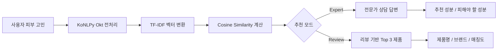
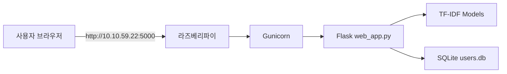

# 🧴 MIMO Skincare Recommendation

## 1. Project Summary (프로젝트 요약)

KoNLPy Okt 형태소 분석, TF-IDF 벡터화, 코사인 유사도를 활용해 사용자의 피부 고민에 맞는 전문가 상담 답변과 올리브영 리뷰 기반 스킨케어 제품을 추천하는 Flask 웹 애플리케이션입니다.

라즈베리파이에 Gunicorn 서버를 올려 같은 네트워크의 브라우저에서 접속할 수 있도록 구성했습니다.

| 구분 | 내용 |
| :---: | :--- |
| 서비스명 | **MIMO** |
| 실행 앱 | `web_app.py` |
| 로컬 주소 | `http://127.0.0.1:5006` |
| 라즈베리파이 주소 | `http://10.10.59.205:5000` |
| 주요 데이터 | 전문가 상담 데이터, 올리브영 제품/리뷰 데이터 |
| 추천 방식 | Expert Match / Review Match |

---

## 2. Key Features (주요 기능)

### 🔤 Korean NLP Preprocessing (한국어 전처리)

- 사용자 피부 고민 문장에서 한글만 추출
- KoNLPy Okt로 명사·동사·형용사 추출
- 2글자 이상 단어와 불용어 필터링 적용

### 📊 TF-IDF Vectorization (문장 벡터화)

- 상담 질문과 리뷰 텍스트를 TF-IDF 벡터로 변환
- 자주 나오지만 의미가 약한 단어보다, 고민을 구분하는 핵심 단어에 높은 가중치 부여

### 📐 Cosine Similarity Recommendation (유사도 기반 추천)

- 사용자 쿼리와 기존 상담/리뷰 데이터를 코사인 유사도로 비교
- 전문가 상담 답변, 추천 성분, 피해야 할 성분 제공
- 리뷰 기반 제품 추천에서는 상위 3개 제품만 반환

### 🌐 Raspberry Pi Web Server (라즈베리파이 웹서버)

- Flask 앱을 Gunicorn으로 실행
- `0.0.0.0:5000` 바인딩으로 같은 네트워크에서 접속 가능
- systemd 서비스 등록 시 부팅 후 자동 실행 가능

---

## 🛠 3. Tech Stack (기술 스택)

### 3.1 Language & Framework


### 3.2 AI / Data Processing


| 기술 | 역할 |
| :---: | :--- |
| KoNLPy Okt | 한국어 형태소 분석 |
| TF-IDF | 상담/리뷰 텍스트 벡터화 |
| Cosine Similarity | 사용자 쿼리와 데이터 간 유사도 계산 |
| Gunicorn | 라즈베리파이 운영용 WSGI 서버 |

---

## 📂 4. Project Structure (프로젝트 구조)

```text
Project_Skincare_Recommendation/
├── web_app.py                              # Flask 최종 실행 앱
├── rebuild_skin_tfidf.py                   # 전문가 상담 TF-IDF rebuild
├── job01_preprocessing.py                  # 원천 상담 데이터 초기 전처리
├── job02_crawl_oliveyoung_products.py      # 올리브영 제품 목록 수집
├── job03_crawl_oliveyoung_reviews_local.py # 올리브영 리뷰 수집
├── job04_preprocess_oliveyoung_reviews.py  # 리뷰 전처리
├── job05_tfidf_oliveyoung_reviews.py       # 리뷰 TF-IDF 모델 생성
├── datasets/                               # 상담/제품/리뷰 CSV 데이터
├── models/                                 # TF-IDF 모델과 행렬 파일
├── templates/                              # Flask HTML 템플릿
├── static/                                 # CSS, favicon, 이미지
├── instance/                               # SQLite DB, secret key
└── reports_html/                           # 발표/보고서 HTML 자료
```

---

## 🔁 5. Data & AI Pipeline (데이터 처리 흐름)

### 5.1 Overall Flow



### 5.2 Expert Match

| 단계 | 처리 내용 |
| :---: | :--- |
| 1 | `skin_data_final.csv`의 `cleaned_question`을 기준으로 TF-IDF 모델 생성 |
| 2 | 사용자 쿼리를 같은 방식으로 전처리 |
| 3 | 상담 데이터 전체와 코사인 유사도 비교 |
| 4 | 프로필 조건을 적용해 가장 가까운 상담 답변 선택 |

### 5.3 Review Match

| 단계 | 처리 내용 |
| :---: | :--- |
| 1 | 올리브영 제품 목록 수집 |
| 2 | 제품별 리뷰 수집 |
| 3 | 리뷰를 제품 단위로 병합 후 전처리 |
| 4 | 리뷰 TF-IDF 모델 생성 |
| 5 | 유사도 높은 제품 최대 3개 추천 |

---

## 🎯 6. Recommendation Thresholds (추천 기준 수치)

| 구분 | 기준 항목 | 기준 수치 |
| :---: | :--- | :---: |
| 전문가 매칭 | 최소 유효 유사도 | `0.20` |
| 전문가 매칭 | 프로필 검색 단계 | 전체 프로필 → 성별 → 전체 데이터 |
| 리뷰 추천 | 최종 추천 제품 수 | `Top 3` |
| 리뷰 추천 | 유효 결과 조건 | `score > 0` |
| 리뷰 추천 | 매칭도 표시 | `similarity × 100` |
| 제품 검색 | 검색 키워드 길이 | 2글자 이상 |
| 제품 검색 | 관련 제품 링크 | 최대 6개 |

> 위 기준은 추천 결과가 지나치게 넓어지거나 관련 없는 제품이 표시되는 것을 줄이기 위한 품질 가이드라인입니다.

---

## 🧪 7. Model Verification (모델 검증)

현재 모델은 기존 데이터 안에서 같은 문장을 다시 찾는 **자기 검색 정확도** 기준으로 검증했습니다.

| 모델 | 데이터 수 | Top-1 자기 검색 | Top-3 자기 검색 |
| :--- | ---: | ---: | ---: |
| 전문가 상담 TF-IDF | 9,049건 | 99.96% | 100.00% |
| 리뷰 TF-IDF | 172건 | 99.42% | 100.00% |

> 이 값은 학습 데이터 내부 재현율입니다. 실제 사용자 입력에 대한 정확도는 별도 사용자 질의 평가셋으로 측정해야 합니다.

---

## 🖥️ 8. Web App & Server Access (웹앱 실행 및 접속)

### 8.1 Local Run

```bash
.venv/bin/python web_app.py
```

| 항목 | 값 |
| :---: | :--- |
| 로컬 주소 | `http://127.0.0.1:5006` |
| 실행 파일 | `web_app.py` |
| DB | `instance/users.db` |

### 8.2 Raspberry Pi Server



| 항목 | 값 |
| :---: | :--- |
| 라즈베리파이 IP | `10.10.59.22` |
| 접속 포트 | `5000` |
| 접속 주소 | `http://10.10.59.22:5000` |
| 서버 실행 | `gunicorn -w 2 -b 0.0.0.0:5000 web_app:app` |
| 자동 실행 | `systemd` 서비스 등록 |

관리 명령:

```bash
sudo systemctl start skincare
sudo systemctl stop skincare
sudo systemctl restart skincare
sudo systemctl status skincare
```

---

## 🖼️ 9. Screens & Visual Materials (화면 및 시각화 자료)

### 9.1 Main Visual

| 홈 화면 이미지 | 분석 화면 이미지 |
| :---: | :---: |
|  |  |

### 9.2 Reports

| 자료 | 내용 |
| :--- | :--- |
| `reports_html/report_konlpy_okt.html` | 한국어 형태소 분석 |
| `reports_html/report_tfidf.html` | TF-IDF 벡터화 |
| `reports_html/report_cosine.html` | 코사인 유사도 |
| `reports_html/ai_methods_report.html` | AI 분석 기법 종합 |
| `reports_html/web_app_report.html` | 웹앱 시스템 보고서 |
| `reports_html/web_app_guide.html` | 코드 흐름 설명 |
| `reports_html/raspi_server_guide.html` | 라즈베리파이 서버 구축 |
| `reports_html/flowchart_presentation.html` | 전체 시스템 흐름도 |

---

## ⚠️ 10. Notes (주의 사항)

| 항목 | 내용 |
| :---: | :--- |
| 원본 데이터 성격 | 전문가 상담 데이터는 문제성 피부 메이크업 추천 데이터이므로 메이크업 조언이 포함될 수 있음 |
| 첫 요청 지연 | KoNLPy JVM 초기화 때문에 첫 추천 요청은 5~15초 정도 걸릴 수 있음 |
| 리뷰 추천 | 스킨/토너, 에센스/세럼/앰플, 크림, 로션 카테고리만 후보로 사용 |
| 실사용 정확도 | 실제 사용자 쿼리 정확도는 별도 평가셋이 필요 |

---

## 🏁 11. Result (결과)

MIMO는 전처리된 상담/리뷰 데이터를 기반으로 사용자의 피부 고민을 벡터화하고, 코사인 유사도 기반으로 상담 답변과 제품 후보를 추천합니다. 로컬 실행뿐 아니라 라즈베리파이 서버에 배포해 같은 네트워크에서 웹 서비스로 접속할 수 있습니다.
